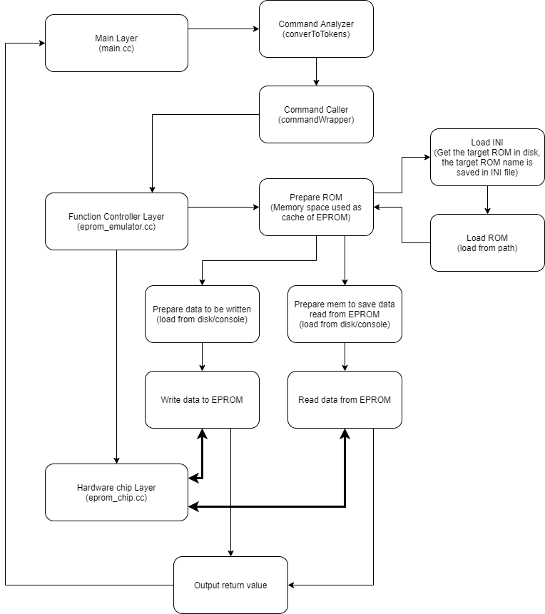

# Summary

In this assignment, I designed an application supporting all commands described in `README.md`.  

The application has 3 layers: the main layer, the function controller layer, and the hardware chip layer.  
* Main layer: analyzes the command and calls functions in the emulator function layer.  
* Function controller layer: implements different functions by calling the EPROM hardware chip interface.  
* Hardware chip layer: encapsulated lower-level chip emulator supporting erase, read data, and write data operations.  

The application has a full development log saved at `./doc/update log.md`.  
The application has passed unit tests. Scripts, inputs, and outputs are saved in the `./doc/` and `./test/` folders.

Here's the process flow:  

# Test Plan

Option 1: Run `./eprom xxx xxx` directly.  
Option 2: Compile at the root folder `make` and run `./eprom xxx xxx`.  
Option 3: Run pre-verified unit test scripts at the root folder.   
  * Run `test/create_load.sh` to test creating and loading an EPROM.  
  * Run `test/read_raw_write_raw_erase.sh` to test reading and writing raw data directly from/to an EPROM.  
  * Run `test/read_write_list.sh` to test reading and writing files from/to an EPROM.  

# Expected Results

* The screenshots are saved at `./doc/*.png`.
* `test/read_write_list.sh` supports auto-verification implemented by the `diff` command.

# Requirements
1. [x] Correctness: Does the emulator correctly implement the required features and handle errors gracefully?  
Verified by unit test.

2. [x] Usability: Is the emulator easy to use and understand?  
Followed the rules in `README.md` and there are example scripts in the `./examples` folder.  

3. [x] Code quality: Is the code well-organized, maintainable, and properly documented?  
Well encapsulated(`class EpromImpl` is user invisible). Maintainable(no hard-coded data). 
 
4. [ ] Bonus: Does the graphical front-end provide a useful visualization of the file system on the virtual EPROM chip?
