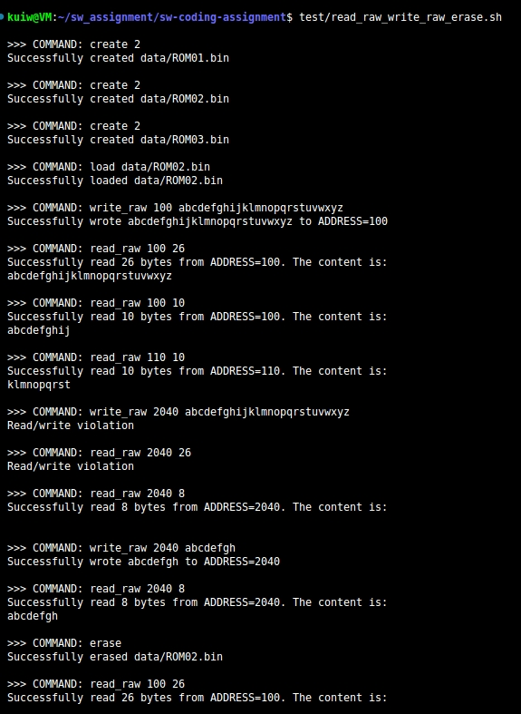

# Release Log
## v1 20240519
### Framework 
Completed the framework of the assignment.  
* Folder structure: build(auto-generated), data(auto-generated), doc, include, src, test, 3rd_party(for future OpenCV/QT).
* Process flow: main -> Eprom Emulator -> Eprom Chip.
  * main: command analyzer. Splitting to tokens and call functions in EpromEmulator.
  * Eprom Emulator: Eprom **high-level** emulator satisfying the requirements in `README.md`.
  * Eprom Chip: **Encapsulated LOW-LEVEL hardware** emulator with read/write/erase functionalities.  

### Compilation & Run
Completed make/makefile based compilation.  
* Automatically detected newly added source code.
* Debug & Release build included.
* `make` in root folder.
* Run with `./eprom COMMAND OPTIONAL_AUGMENTS`, as described in `README.md`.

### Completed features
As required in `README.md`.
* create
* erase
* load
* read_raw
* write_raw

### ROM loading system
* Completed _ini_ based ROM loading system. 

### Auto-format system
* Based on `.clang-format` and `clang-formater-12`.  
* Integrated in makefile. Auto-formatted before compilation.

### Document
* Update Log v1 20240519
* Unit test record image: screenshot_create_load.png, screenshot_read_raw_write_raw_erase.png

### Unit test 
Passed the following unit test.
  * test/create_load.sh  
  
  * test/read_raw_write_raw_erase.sh  
  

### TODO
* Features:  
  * list
  * read
  * write

* Doc:  
  * Process flow.

* Code:  
  * Comments

